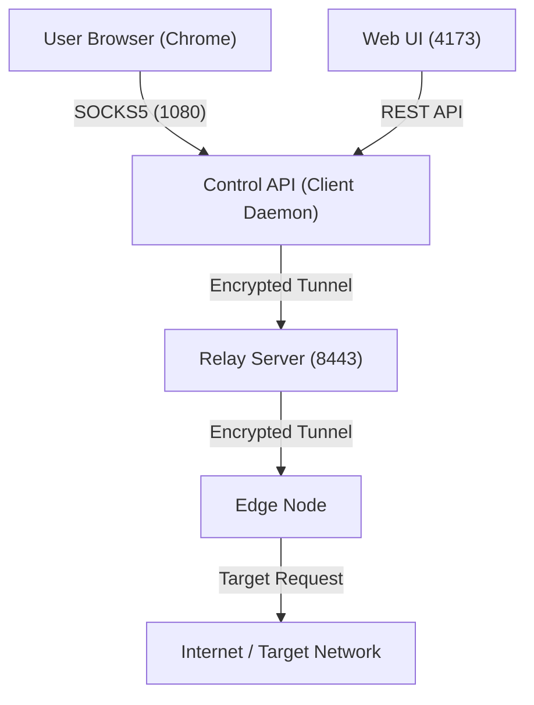

# vpn-simple
Bootstrap with ./bootstrap.sh

## Overall Project Flow

This VPN implementation follows a hub-and-spoke architecture with a central relay and multiple edge nodes/daemons.



1.  **Relay Server**: Acting as the orchestrator, it bridges traffic between edge nodes and client daemons.
2.  **Edge Node**: The exit point of the VPN. It connects to the relay and awaits data to forward to the destination.
3.  **Control API (Client Daemon)**: Runs locally on the user's machine. It exposes a SOCKS5 proxy server and a control interface.
4.  **Web UI**: A Vite-based dashboard for monitoring connection health, performance, and logs.

---

## Getting Started

### 1. Setup Environment
Ensure you have Python 3.10+ installed. Install dependencies:
```bash
pip install -r backend/requirements.txt
cd frontend/web-ui && npm install
```

### 2. Run the System
The easiest way to start all components on Windows is via the provided PowerShell script:

```powershell
./scripts/start_all.ps1
```

This script will launch four separate PowerShell windows:
- **Server**: The relay bridge.
- **Edge Node**: The exit node.
- **Control API**: The client daemon (SOCKS5 proxy).
- **Web UI**: The management dashboard.

### 3. Individual Component Scripts
If you need to run components manually or on Linux:
- `relay`: Run `./scripts/run_server.ps1` (or `run_server.sh`)
- `edge`: Run `./scripts/run_edge.ps1`
- `api`: Run `./scripts/run_api.ps1`
- `web`: Run `./scripts/run_web.ps1` (or `run_web.sh`)

---

# Important: Run Chrome Through PowerShell (Required)

You MUST launch Google Chrome using the following command in PowerShell.
Only then will the browser traffic pass through our SOCKS5 proxy and be captured by our code and logs.

If you open Chrome normally, traffic will *NOT* be routed through the proxy.

## PowerShell Command (Run Exactly As Below)
& "C:\Program Files\Google\Chrome\Application\chrome.exe" --proxy-server="socks5://127.0.0.1:1080" --user-data-dir="$env:TEMP\chrome-vpn-profile" --no-first-run "https://www.whatismyip.com"

### Why This Is Necessary
- Forces Chrome to use our SOCKS5 proxy (127.0.0.1:1080)
- Ensures all browser traffic goes through our VPN logic
- Allows proper logging, monitoring, and verification
- Uses a separate Chrome profile to avoid conflicts with existing sessions
